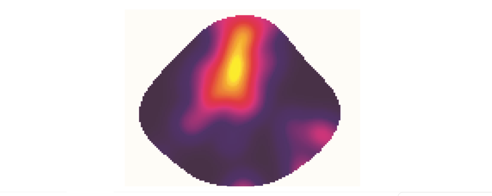
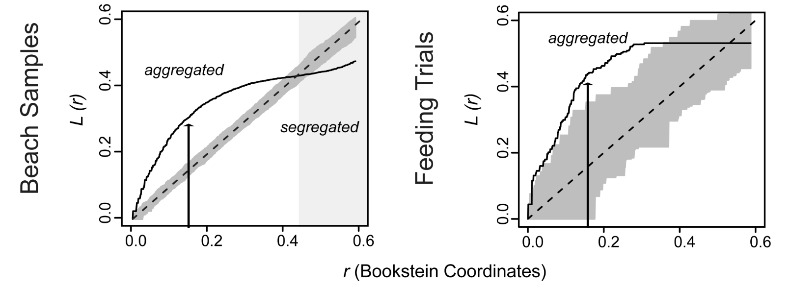

___
### SPPAT: Spatial point pattern analysis of traces

Trace fossils left by predators on skeletons of their prey, including drillholes, repair scars, fractures, and tooth marks, are the most powerful direct indicators on predator-prey interactions available in the fossil record. For instance, predatory drillholes can provide valuable behavioral information regarding selectivity of predatory attacks in terms of prey species, prey size, or drilling location on the prey skeleton (site-selectivity). Although predatory drillholes are spatially explicit traces that represent a uniform record of a single behavior and are frequent enough to make statistical analyses, current approaches used to evaluate site-selectivity ignore some spatial information.

Spatial point pattern derived from drilling data on Plio-Pleistocene bivalves from the Atlantic coastal plain
The recognition that drillholes on prey skeletons are spatially explicit and can be mapped enables the development of a proxy for site-selectivity in drilling predation based on spatial point process modeling. In this paper, we introduce the spatial point pattern analysis of traces (SPPAT), an approach for visualizing and quantifying the distribution of predation traces on shelled invertebrate prey, which includes improved collection of spatial information inherent to drillhole location, improved visualization of spatial trends, and distance-based statistics for hypothesis testing.

Graphical output from the distance-based statistics estimated on the fossil samples, modern beach-collected samples, and laboratory feeding trials
We illustrate the SPPAT approach through case studies of fossil samples, modern beach samples, and modern experiments of gastropod predation on bivalve prey. SPPAT provides information on spatiotemporal changes in site-selectivity patterns of drilling predators, including variation in alternative shell-drilling behaviors, useful for understanding predator behavior and anti-predatory responses of prey. The SPPAT approach is transferrable to a wide spectrum of paleoecologic and taphonomic data such as encrustation and bioerosion, allowing for standardized investigation of a wide range of biotic interactions.

___
### References
Karapunar, B., Werner, W., Simonsen, S., Bade, M.,  Lücke, M., Rebbe, T., Schubert, S., <b>Rojas</b>, <b>A</b>. (2023). Drilling predation on Early Jurassic bivalves and behavioral patterns of the presumed gastropod predator — evidence from Pliensbachian soft bottom deposits of northern Germany. Paleobiology. <i>In press</i>

<b>Rojas</b>, <b>A</b>., Dietl, G. P., Kowalewski, M., Portell, R. W., Hendy, A., and Blackburn, J. K. (2020). Spatial point pattern analysis of traces (SPPAT): An approach for visualizing and quantifying site-selectivity patterns of drilling predators. Paleobiology 46, 259–271. [PDF](https://doi.org/10.1017/pab.2020.15)

<b>Rojas</b>, <b>A</b>., Portell, R. W., and Kowalewski, M. (2017). The post-Palaeozoic fossil record of drilling predation on lingulide brachiopods. Lethaia 50, 296–305.[PDF](https://doi.org/10.1111/let.12198)

<b>Rojas</b>, <b>A</b>., Hendy, A., and Dietl, G. P. (2015). Edge-drilling behavior in the predatory gastropod <i>Notocochlis unifasciata</i> (Lamarck, 1822) (Caenogastropoda, Naticidae) from the Pacific coast of Panama: taxonomic and biogeographical implications. Vita Malacologica, 63–72. [PDF](https://repository.si.edu/bitstream/handle/10088/27807/2015%20Rojas%20VitaMalac.pdf?sequence=1&isAllowed=y)
