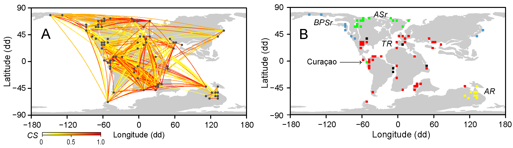
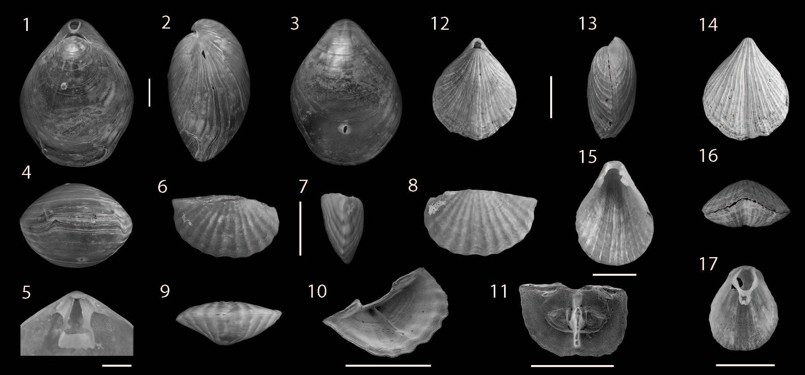
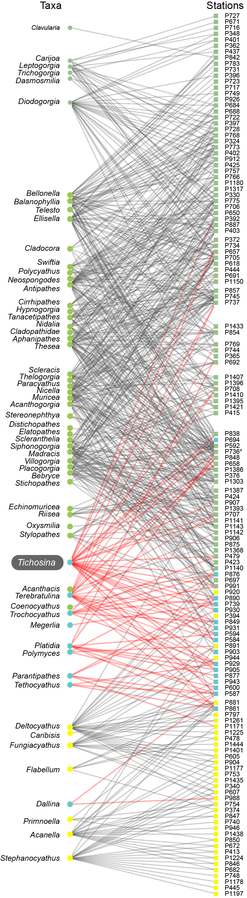

## Network-based biogeography
Investigating the spatial structure of the marine biodiversity has long been an important area of biological and palaeontological research.  Biogeographic studies on fossil organisms have contributed to our current understanding of the relationship between plate tectonics, Earth’s climate and the evolution of life. However, the impact of those studies extends beyond basic biogeographic questions to include, for example, conservation biology, regional geology, and stratigraphy. In this study we tested the traditional biogeographic scenario of the Albian Ammonoids using a network-based approach.

## Cretaceous brachiopods from northern South America
The Mesozoic fossil record of brachiopods in northern South America is relatively scarce and their biogeographical history is not well understood. Cretaceous brachiopods in this region are restricted to carbonate platforms of Colombia. We describe a new species of <i>Sellithyris</i> showing morphological similarities with Valanginian species from the ancient Gulf of Mexico. Using a semi-quantitative taphonomic analysis, we identified a largescale erosional hiatus in the biochronology of some Valanginian sediments from Colombia.

## Caribbean Brachiopods from Colombia
Modern ad fossil brachiopod faunas from Colombia have not been studied extensively. We published a series of papers examining recent material collected from deep-water coral environments (90–250 m) located off the San Bernardo Archipelago. The studied material comprises four species, two of which are new records for Colombia: <i>Terebratulina cailleti</i> Crosse, 1865and <i>Tichosina plicata</i> Cooper, 1977. The genus <i>Tichosina</i> comprises twenty extant species occurring across the Caribbean. The species <i>Tichosina bullisi</i> Cooper, 1977 and <i>Tichosina dubia</i> Cooper, 1977 were synonymized with <i>Tichosina plicata</i> Cooper, 1977.

Despite its importance as the larger component of the modern and Cenozoic brachiopod faunas in the Caribbean region, the ecology and habitat preferences of the terebratulid <i>Tichosina</i> remain poorly understood. We further compiled feld observations from multiple sites in the Caribbean of Colombia (i.e., San Bernado Bank, Bahia Honda-Guajira, Puerto Escondido, Joint Regime Area Jamaica-Colombia) and data from the R/V Pillsbury program, indicating that <i>Tichosina</i> may have close ecological ties with deep-water corals. In addition, we reviewed literature sources on Cenozoic sediments in the Dominican Republic and found tentative evidence that such ecological ties could have existed since at least the Pliocene. These observations are reminiscent of the <i>Gryphus</i>-anthozoan association observed along the modern Mediterranean continental margin. Understanding to what extent the brachiopod <i>Tichosina</i> is linked to deep-water habitats has implications for the recognition of deep-water macrobenthic communities in the Cenozoic rock record of the Caribbean.

