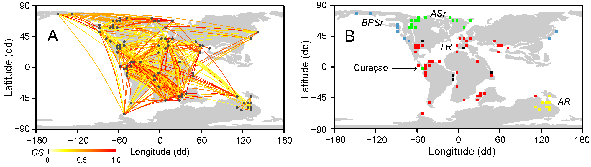

## Network-based biogeography
Investigating the spatial structure of the marine biodiversity has long been an important area of biological and palaeontological research.  Biogeographic studies on fossil organisms have contributed to our current understanding of the relationship between plate tectonics, Earth’s climate and the evolution of life. However, the impact of those studies extends beyond basic biogeographic questions to include, for example, conservation biology, regional geology, and stratigraphy. In this study we tested the traditional biogeographic scenario of the Albian Ammonoids using a network-based approach.

## Cretaceous brachiopods from northern South America
The Mesozoic fossil record of brachiopods in northern South America is relatively scarce and their biogeographical history is not well understood. Cretaceous brachiopods in this region are restricted to carbonate platforms of Colombia. We describe a new species of <i>Sellithyris</i> showing morphological similarities with Valanginian species from the ancient Gulf of Mexico. Using a semi-quantitative taphonomic analysis, we identified a largescale erosional hiatus in the biochronology of some Valanginian sediments from Colombia.

## Caribbean Brachiopods from Colombia
Modern ad fossil brachiopod faunas from Colombia have not been studied extensively. We published a series of papers examining recent material collected from deep-water coral environments (90–250 m) located off the San Bernardo Archipelago. The studied material comprises four species, two of which are new records for Colombia: Terebratulina cailleti Crosse, 1865and Tichosina plicata Cooper, 1977. The genus Tichosina comprises twenty extant species occurring across the Caribbean.  The species Tichosina bullisi Cooper, 1977 and Tichosina dubia Cooper, 1977 were synonymized with Tichosina plicata Cooper, 1977.
