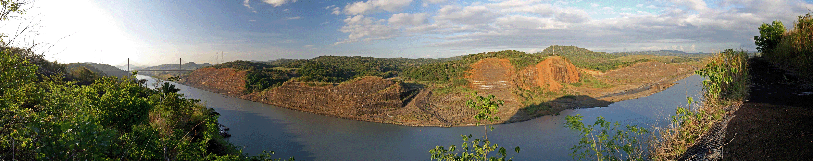
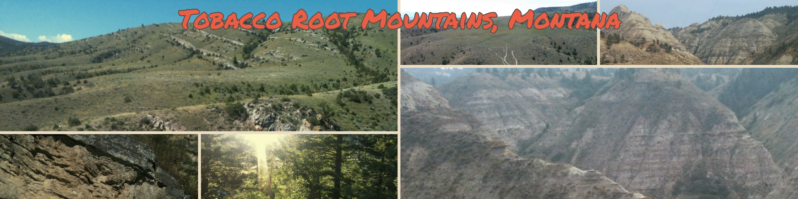

___
### Geology and paleontology of Northern South America
I have been carrying out geological and paleontological fieldwork in Colombia with the [Grupo de Investigación en Estratigrafía](http://www.hermes.unal.edu.co/pages/Consultas/Grupo.xhtml?idGrupo=2183&opcion=1) at the Universidad Nacional de Colombia, led by Professor Pedro Patarroyo, who has been an important mentor throughout my academic journey. My research has focused on the Upper Paleozoic and Cretaceous marine fossil record, particularly brachiopod assemblages and their taxonomy, biostratigraphic significance, and paleobiogeographic affinities.

Explore my fieldwork history in the tropics through this interactive [Google Earth tour](https://earthengine.google.com/timelapse/#tour=DOAofcI83dI5iQoHSouth%20America_AofcI83dI5iQiOColombia_Aofco5LdmxPQofVilla%20de%20Leyva%20-%20Boyaca_AofcRtWdGTPQofLa%20Paz%20-%20Santander_AofcX5idrQSQofZapatoca%20-%20Santander_AofcxUddv4XQofRio%20Nevado%20-%20Santander_AofcI83dI5iQiO_AofcQZceo15PofArchipelago%20of%20San%20Bernardo_AofcI83dI5iQiO_AofcekPeNZWPyQCentral%20America_AofcekPeNZWPvdPanama%20City%2C%20Panama_AofcekPeNZWPyQ_AofcpQket2cO3ZGuanacaste%20-%20Costa%20Rica_AofcekPeNZWPyQ_Selected%20Field%20Localities_B)

___
### Geology and Paleontology in Central America

For an overview of my fieldwork experience beyond Colombia see RESEARCH-PROGRAM.

___
### Geology and Paleontology in North America

___
### Theses
<b>Alexis Rojas</b>. “Paleobiological Implications of the Post-Paleozoic Fossil Record of the Lingulide Brachiopods and Associated Faunas. CHAPTER 2 LOWER CRETACEOUS BRACHIOPODS FROM COLOMBIA (SOUTH AMERICA): BIOSTRATIGRAPHIC SIGNIFICANCE AND PALEOGEOGRAPHIC IMPLICATIONS". PhD Thesis, University of Florida, 2017. [PDF](https://ufdcimages.uflib.ufl.edu/UF/E0/05/12/69/00001/ROJAS_A.pdf)

<b>Alexis Rojas</b>. “Patrones de Distribución de La Fauna de Braquiópodos Pensilvanianos Del Rio Nevado, Colombia.” Tesis de pregrado. Departamento de Geociencias, Universidad Nacional de Colombia, 2008. Financiado por el Fondo Corrigan de la Asociación Colombiana de Geólogos y Geofísicos de la Energía (ACGGP) y Corporación Geológica ARES. [PDF](https://www.acggp.org/fondo-corrigan)

### Publications
<b>Alexis Rojas</b> and Michael R. Sandy. “Early Cretaceous (Valanginian) Brachiopods from the Rosablanca Formation, Colombia, South America: Biostratigraphic Significance and Paleogeographic Implications.” Cretaceous Research 96 (April 2019): 184–195 [PDF](https://doi.org/10.1016/j.cretres.2018.12.011)

Michael R. Sandy and <b>Alexis Rojas</b>. “Paleobiogeographic Affinities, Biostratigraphic Potential, and Taxonomy of Cretaceous Terebratulide Brachiopods from Colombia.” In Geological Society of America Abstracts with Programs, 50 (6):325121. Indianapolis, Indiana, USA: The Geological Society of America, 2018. [PDF](https://gsa.confex.com/gsa/2018AM/webprogram/Paper325121.html)

Garcia, Jorge, Agusto Oyuela-Caycedo, and <b>Alexis Rojas</b>. “Holocene Paleoclimate Reconstruction from Δ18O Isotopes of Neocyclotus Opercula a Morphometric Analysis of Variation at the Archaic Site of San Jacinto 1.” In Society for American Archaeology Annual Meeting, Vol. tDAR id: 395000. San Francisco, California, USA: Society for American Archaeology, 2015. [PDF](https://core.tdar.org/browse/creators/154313/jorge-garcia)

<b>Alexis Rojas</b>. “The First Record of Lower Cretaceous Lingulidae (Brachiopoda) From the Tropical America.” In Geological Society of America Abstracts with Programs, 45 (2):10. San Juan, Puerto Rico: The Geological Society of America, 2013. [PFD](https://gsa.confex.com/gsa/2013SE/webprogram/Paper215804.html)

<b>Alexis Rojas</b>, Pedro Patarroyo, and Adriana Gracia. “Spatial Structure and Bathymetric Distribution of Caribbean Brachiopods in San Bernardo, Colombia: Using Brachiopods as a Potential Proxy of Paleobathymetry.” In Geological Society of America Abstracts with Programs, 45 (7):321. Denver, Colorado, USA: The Geological Society of America, 2013. [PDF](https://gsa.confex.com/gsa/2013AM/webprogram/Paper230143.html)

Patarroyo, Pedro, <b>Alexis Rojas</b>, and Andres Salamanca. “Stratigraphy of the Lower Calcareous Member (Valaniginian - Hauterivian), Tibasosa Formation, Tibasosa – Boyacá (Colombia, S. A.).” In 23rd International Colloquium on Latin  American Earth Sciences, Abstracts and Programme. GAEA, 124. Heidelberg, Germany: GAEA heidelbergensis, 2014. [PDF](https://doi.org/10.13140/2.1.2391.4882)

Mena Schemm-Gregory, <b>Alexis Rojas</b>, Pedro Patarroyo and Carlos Jaramillo. "First report of  Hadrosia Cooper, 1983 in South America and its biostratigraphical and palaeobiogeographical implications". Cretaceous Research 34 (2012), 257–267. [PDF](https://doi.org/10.1016/j.cretres.2011.11.005)

<b>Alexis Rojas</b>. “The First Record of Lower Cretaceous Lingulidae (Brachiopoda) From the Tropical America.” In Geological Society of America Abstracts with Programs, 45 (2):10. San Juan, Puerto Rico: The Geological Society of America, 2013. [PDF](https://gsa.confex.com/gsa/2013SE/webprogram/Paper215804.html)

<b>Alexis Rojas</b>, Mena Schemm-Gregory, Austin J. W. Hendy, Javier Luque, and Carlos Jaramillo. “New Records of Lingulid Brachiopods from Northern South America and Their Biogeographical Implications.” In 54th PalAss Meeting Abstracts with Programs, 75:69. Ghent, Belgium: The Palaeontological Association, 2010. [PDF](https://palass.org/past-meeting-programmes-and-abstracts)

Francisco J. Vega, Torrey Nyborg, Greg Kovalchuk, Javier Luque, <b>Alexis Rojas</b>., Pedro Patarroyo, Héctor Porras-Múzquiz, Adam Armstrong, Hermann Bermúdez, and Luis Garibay. “On Some Panamerican Cretaceous Crabs (Decapoda: Raninoida).” Boletín de La Sociedad Geológica Mexicana 62, no. 2 (2010): 263–279. [PDF](http://www.jstor.org/stable/24921180)

Pedrp Patarroyo and <b>Alexis Rojas</b>. (2007): La sucesión y la fauna del Turoniano de la Formación San Rafael en pesca y su comparación con la sección tipo en Samacá (Boyacá- Colombia-s.a.). Geologia Colombiana, 89–96. [PDF](https://repositorio.unal.edu.co/handle/unal/42401)

Francisco J. Vega, Torrey Nyborg,<b>Alexis Rojas</b>, Pedro Patarroyo, Javier Luque, Hector Porras-Muzquiz, and Wolfgang Stinnesbeck. “Upper Cretaceous Crustacea from Mexico and Colombia: Similar Faunas and Environments during Turonian Times.” Revista Mexicana De Ciencias Geologicas 24 (2007): 403–22. [PDF](http://www.scielo.org.mx/scielo.php?script=sci_arttext&pid=S1026-87742007000300009&nrm=iso)

Pedro Patarroyo  and <b>Alexis Rojas</b>. “La Sucesión y La Fauna Del Turoniano de La Formación San Rafael En Pesca y Su Comparación Con La Sección Tipo En Samacá (Boyacá- Colombia-s.a.).” Geologia Colombiana, no. 32 (2007): 89–96. [PDF](https://repositorio.unal.edu.co/handle/unal/42401)
