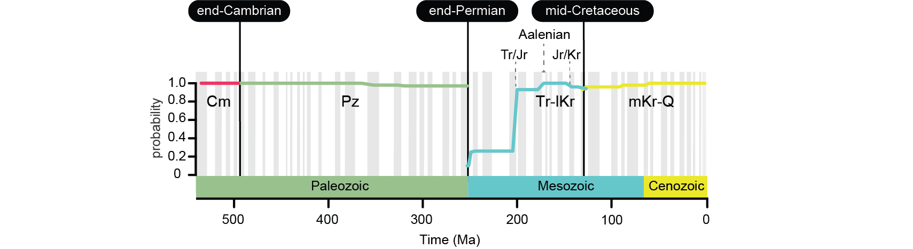

___
### A multiscale view of the Phanerozoic Life

The hypothesis of the Great Evolutionary Faunas is a foundational concept of macroevolutionary research postulating that three global mega-assemblages have dominated Phanerozoic oceans following abrupt biotic transitions. Empirical estimates of this large-scale pattern depend on several methodological decisions and are based on approaches unable to capture multiscale dynamics of the underlying Earth-Life System. Combining a multilayer network representation of fossil data with a multilevel clustering that eliminates the subjectivity inherent to distance-based approaches, we demonstrate that Phanerozoic oceans sequentially harbored four global benthic mega-assemblages. 

Shifts in dominance patterns among these global marine mega-assemblages were abrupt (end-Cambrian 494 Ma; end-Permian 252 Ma) or protracted (mid-Cretaceous 129 Ma), and represent the three major biotic transitions in Earth's history. Our findings suggest that gradual ecological changes associated with the Mesozoic Marine Revolution triggered a protracted biotic transition comparable in magnitude to the end-Permian transition initiated by the most severe biotic crisis of the past 500 million years. Overall, our study supports the notion that both long-term ecological changes and major geological events have played crucial roles in shaping the mega-assemblages that dominated Phanerozoic oceans.

### Four evolutionary faunas sequentially dominated Phanerozoic oceans

___
### References
<b>Rojas</b>, <b>A</b>., Eriksson, A., Neuman, M., Edler, D., Blöcker, C., and Rosvall, M. A natural history of networks: Higher-order network modelling for research in paleobiology. Under review.

Eriksson, A., Carletti, T., Lambiotte, R., <b>Rojas</b>, <b>A</b>., and Rosvall, M. (2022). “Flow-Based Community Detection in Hypergraphs,” in Higher-Order Systems Understanding Complex Systems., eds. F. Battiston and G. Petri (Cham: Springer International Publishing), 141–161. [PDF](https://link.springer.com/chapter/10.1007/978-3-030-91374-8_4)

Kirkley, Alec, <b>Rojas</b>, <b>A</b>., Rosvall, M., and Young, J-G. Compressing network populations with modal networks reveals structural diversity. Under Review. [PDF](https://doi.org/10.48550/arXiv.2209.13827)

<b>Rojas</b>, <b>A</b>., Calatayud, J., Kowalewski, M., Neuman, M., and Rosvall, M. (2021). A multiscale view of the Phanerozoic fossil record reveals the three major biotic transitions. Commun Biol 4, 309. [PDF](https://doi.org/10.1038/s42003-021-01805-y)

Eriksson, A., Edler, D., <b>Rojas</b>, <b>A</b>., de Domenico, M., and Rosvall, M. (2021). How choosing random-walk model and network representation matters for flow-based community detection in hypergraphs. Commun Phys 4, 133. [PDF](https://doi.org/10.1038/s42005-021-00634-z)
